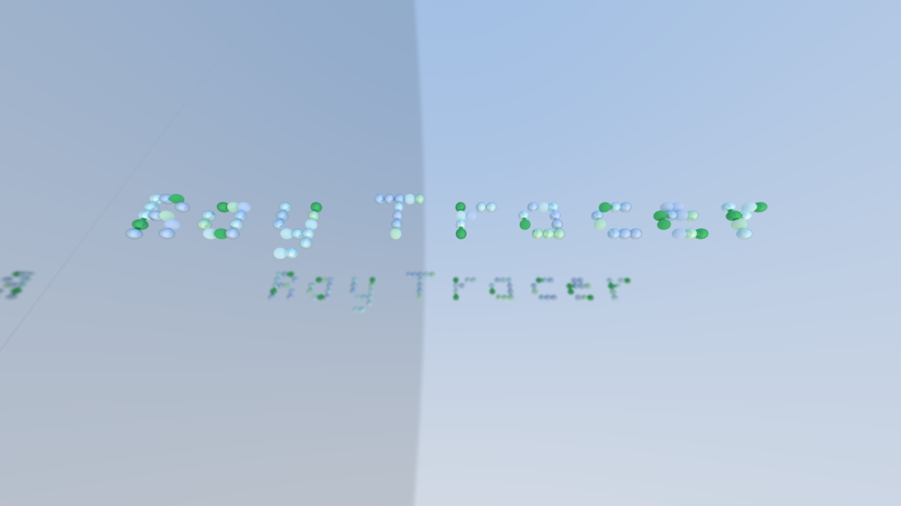

# Ray Tracer

The project I finished in time but still failed with.

It is based on [Ray Tracing in One Weekend by Peter Shirley](https://raytracing.github.io/books/RayTracingInOneWeekend.html).

## Features

- Text rendering
- Multi threaded rendering
- Materials: Lambertian, Metal, Dielectric
- Hittable objects: Spheres

## Dependencies

- [stb](https://github.com/nothings/stb)
